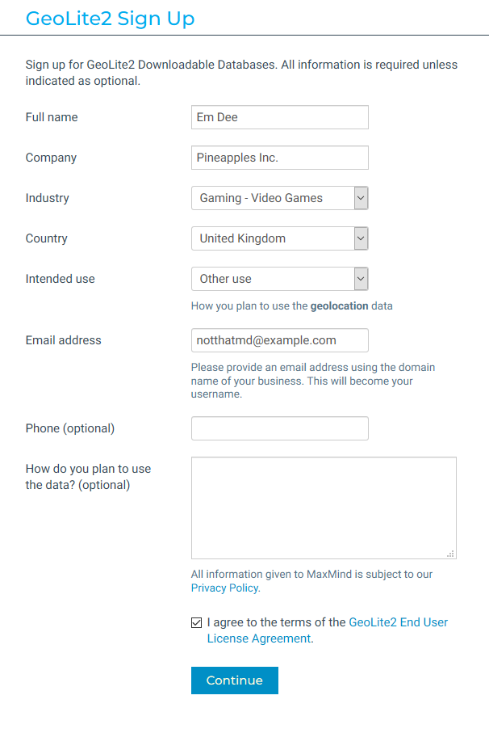
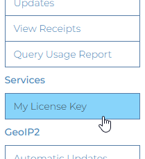
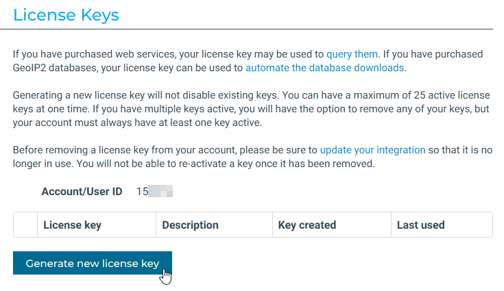
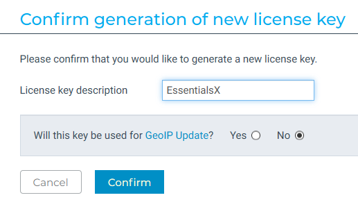
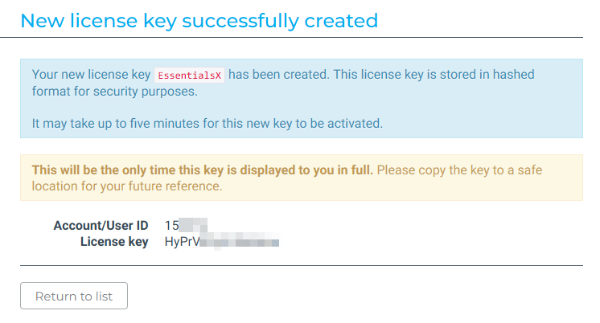

# EssentialsX GeoIP

EssentialsX GeoIP integrates geographical IP lookup features into EssentialsX, allowing you to determine approximately where your players come from.

<b-message>

This product includes GeoLite2 data created by MaxMind, available from [https://www.maxmind.com](https://www.maxmind.com).

</b-message>

<b-message type="is-info">

**Note:** as of December 30th 2019, MaxMind now requires users to sign up and create a key in order to access the GeoLite2 database used by EssentialsX.
You can read more about the reason behind these changes on the [MaxMind blog](https://blog.maxmind.com/2019/12/18/significant-changes-to-accessing-and-using-geolite2-databases/).

This affects *all* versions of EssentialsX, not just new versions. To restore your setup, you'll need to update the module and follow the steps below, even if you were using GeoIP prior to this date.

</b-message>

## Setting up the plugin

First, you'll need to register for access to the GeoLite2 database, which EssentialsX downloads and uses to perform IP lookups.

Go to the [MaxMind website](https://www.maxmind.com/en/geolite2/signup) and fill in your details to sign up for access to the GeoLite2 database:

You'll need to agree to the [GeoLite2 EULA](#legal-notices) in order to use the database.

Click **Continue**, then once you've received your email from MaxMind, set up a password using the link in the email, and log into your MaxMind account.

Once you're logged in, scroll down and click **My License Key** on the left-hand side:

Next, click **Generate new license key**:

Type in a name like `EssentialsX key` as the description and click **No** in the box below, then click **Confirm**:

You should now receive a **license key**. Copy this down somewhere safe, as you won't be able to see the original key again later on.

Next, you'll need to download and install the EssentialsXGeoIP jar - you can see how to do this [[here|Installing-EssentialsX]].
Start and stop your server, then open `plugins/EssentialsGeoIP/config.yml` in a text editor.
Copy the license key from before into the `license-key` setting, save the file and then restart your server.

Once you start the server up, the plugin will download the database using your license key and will keep it up-to-date every 30 days.

## Using the plugin

EssentialsX GeoIP provides the permission `essentials.geoip.show`. With this permission, staff will be able to:
- See a player's approximate location when they log in
- See a player's approximate location when you run `/whois <player>`

Giving a player the permission `essentials.geoip.hide` will prevent their location showing up in either of these situations.

## Legal notices

<b-message type="is-error">

To use EssentialsX GeoIP, you need to agree to the [MaxMind GeoLite2 EULA](https://www.maxmind.com/en/geolite2/eula). As a result:
- **You must not attempt to use EssentialsX GeoIP to determine the exact location of players.** IP lookups using GeoLite2 are approximate, and they will not give you the precise location of a player.
- **You must allow EssentialsX GeoIP to update the database every 30 days.** You should avoid using one-time tokens to download the database or keeping old versions of the database around.

Not following these may break the MaxMind EULA and possibly also break state, federal or international privacy laws. **EssentialsX is not responsible if you fail to follow these guidelines.**

</b-message>
